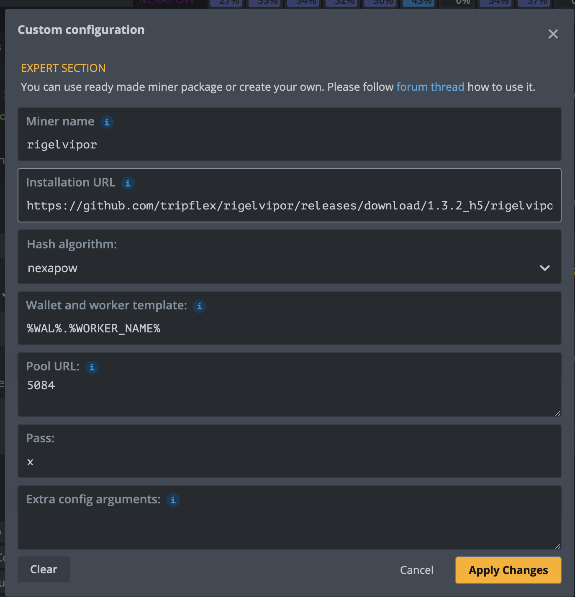

Rigel Vipor.NET Hive OS Custom Miner

This is a custom miner for Hive OS that uses the Rigel miner, to integrate into HiveOS with stats until they release official support.

# Installation
- Open hive and create a new flightsheet
- Right click on the `rigelvipor-1.3.2_hXX.tar.gz` file and copy link address (ie `https://github.com/tripflex/rigelvipor/releases/download/1.3.2_h5/rigelvipor-1.3.2_h5.tar.gz`) from latest release page:
- https://github.com/tripflex/rigelvipor/releases/latest
- Paste the link into the **Installation URL** field
- Enter in the **NON-SSL** Port you want to use on https://vipor.net in the **POOL URL**

**NOTE:** This will only work on https://vipor.net

![Select custom miner])

